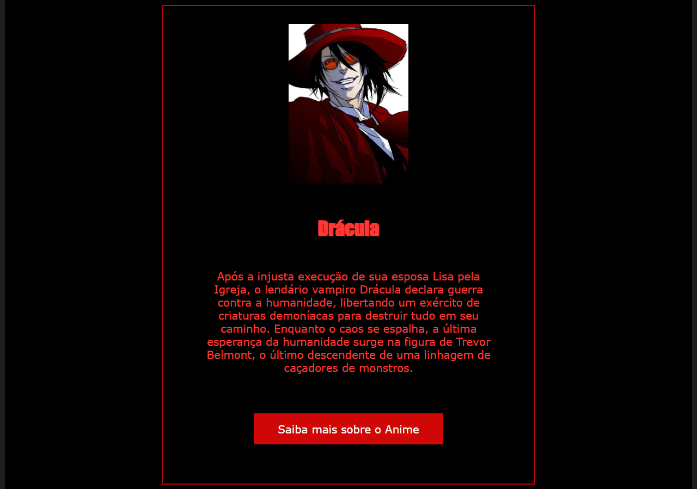

# 🩸 Castlevania: A Maldição de Drácula  

🎭 Um projeto prático para estudar **HTML** e **CSS**, inspirado no universo sombrio de *Castlevania*, destacando a história de Drácula e sua vingança contra a humanidade.  

## 📌 Sobre o Projeto  
Este projeto apresenta um site temático baseado no anime *Castlevania*, trazendo informações sobre Drácula, sua origem trágica, seus inimigos e a luta épica entre humanos e vampiros.  

### 💻 Tecnologias utilizadas  
- HTML5  
- CSS3  

## 📸 Preview  
  

## 🚀 Como Executar o Projeto  
1. Clone este repositório:  
   ```bash
   git clone https://github.com/seu-usuario/castlevania-dracula.git
   ```
2. Acesse a pasta do projeto:  
   ```bash
   cd castlevania-dracula
   ```
3. Abra o arquivo `index.html` no seu navegador.  

## 🎨 Personalização  
Sinta-se à vontade para modificar o código e explorar diferentes estilos no CSS para tornar o projeto ainda mais sombrio e envolvente!  

## 📝 Licença  
Este projeto foi criado apenas para fins educacionais e inspiracionais, sem fins lucrativos.  
